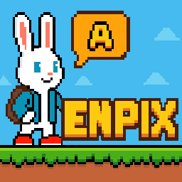
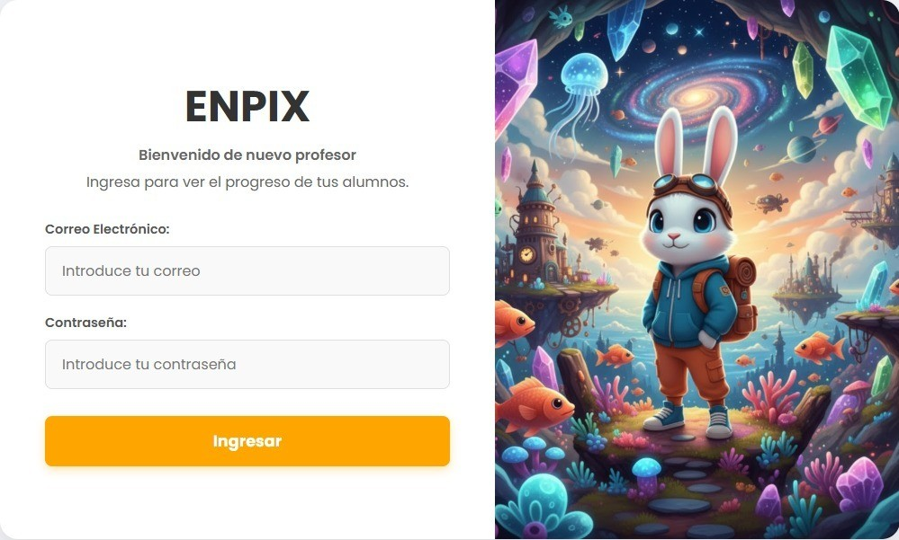

<div align="center">
  

  <h1>🌟 Videojuego Educativo - Escuela Nueva 🌟</h1>
  <p><em>Aprendizaje de inglés interactivo para niños de entornos rurales</em></p>

  <a href="https://github.com/MishelleBohorquez/VideojuegoEducativo/stargazers"></a>
  <a href="https://github.com/MishelleBohorquez/VideojuegoEducativo/issues"></a>
  <a href="https://github.com/MishelleBohorquez/VideojuegoEducativo/network/members"></a>
</div>

---

## 📝 Descripción del Proyecto

Este ecosistema de software está compuesto por un **Videojuego Educativo** y una **Plataforma Web de Gestión**, diseñados específicamente para apoyar la enseñanza de un segundo idioma (inglés) en una escuela rural regida bajo el modelo educativo de **Escuela Nueva**.

El proyecto está dirigido a estudiantes de **1° a 5° de primaria**, estructurando el aprendizaje a través de distintos niveles organizados por temáticas. Todo el proceso de desarrollo y conceptualización estuvo acompañado de una fase de investigación, cuyos hallazgos y resultados han sido documentados en un artículo académico.

Además del juego, el ecosistema cuenta con un **Dashboard Web para Docentes**, una herramienta integral que permite al profesor hacer seguimiento del rendimiento de los alumnos. El docente puede visualizar las notas generales del curso, el desempeño individual por estudiante y los resultados específicos obtenidos en cada nivel temático.

## ✨ Características Principales

- 🎮 **Aventura Educativa:** Múltiples niveles temáticos adaptados a los grados de primaria para enseñar inglés de forma lúdica.
- 👨‍🏫 **Dashboard para Docentes:** Panel de control web para visualizar métricas, notas generales y rendimiento específico de cada estudiante.
- 🎨 **Arte Original:** Todos los recursos gráficos, sprites y animaciones del juego fueron creados de forma original por el equipo.
- 📊 **Gestión de Datos:** Sistema de calificaciones en tiempo real conectado al videojuego.
- 🔬 **Respaldo Académico:** Metodología fundamentada en investigación orientada al modelo de Escuela Nueva.

## 🛠️ Tecnologías Utilizadas

- **Motor de Videojuego:** Godot Engine (GDScript).
- **Diseño y Arte Visual:** Aseprite (Creación propia de todas las imágenes y sprites).
- **Plataforma Web (Frontend):** HTML5, CSS3.
- **Base de Datos y Backend:** PostgreSQL, Supabase.

## 🚀 Instalación y Despliegue

### Para el Videojuego (Godot)
1. Clona este repositorio:
   ```bash
   git clone https://github.com/MishelleBohorquez/VideojuegoEducativo.git
   ```
2. Importa la carpeta del proyecto desde el **Godot Engine**.
3. Ejecuta la escena principal (`main.tscn` o similar) para iniciar el juego.

### Para la Plataforma Web del Docente
1. Accede a la carpeta correspondiente al panel web.
2. Configura las variables de entorno para la conexión con **Supabase / PostgreSQL**.
3. Abre el archivo principal en un navegador o despliégalo utilizando un servidor local o un servicio de hosting web.

## 📸 Capturas de Pantalla

| Gameplay - Nivel Temático | Plataforma docente |
|:---:|:---:|
|  |  |

## 👩‍💻 Autoras

**Ruddy Alejandra Gil Orjuela** 
- Ingeniera de Sistemas y Computación 💻
- [LinkedIn](https://www.linkedin.com/in/ruddy-alejandra-gil-orjuela/)
- GitHub: [@RuddyA24](https://github.com/RuddyA24)

**Dayan Mishelle Bohorquez Rojas** 
- Ingeniera de Sistemas y Computación 💻
- [LinkedIn](https://www.linkedin.com/in/dayan-mishelle-bohorquez-rojas-6885a920b/)
- GitHub: [@MishelleBohorquez](https://github.com/MishelleBohorquez)

---
<div align="center">
  Hecho con ❤️ y mucho código para transformar la educación rural.
</div>
